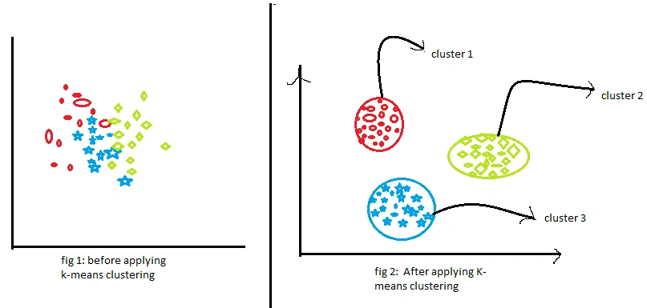

# Land Use and Land Cover (LULC) Classification on Sentinel-3 Satellite Imageries
by: Amirul Azizi 22074200

## 📌 Problem Description

An accurate land cover classification is essential for monitoring environmental change, supporting urban planning, and informing policy decisions. Traditional classification methods can be labor-intensive and require extensive ground truth data. The goal of this project is to classify land cover over the southern United Kingdom region using Sentinel-3 satellite imagery and machine learning techniques. Both **unsupervised (K-Means)** and **supervised (Random Forest)** classification methods will be implemented, and their performance will be evaluated through visual and statistical comparisons.

Figure below summarise the workflow of this project:


**K-Means clustering** is an unsupervised machine learning algorithm used to group data points such as image pixels into a predefined number of clusters based on their feature similarity. In the context of remote sensing, each pixel is treated as a data point, with its spectral values (e.g., RGB, NDVI) serving as input features. The algorithm works by randomly initialising cluster centroids, assigning each pixel to the nearest centroid, recalculating centroids based on cluster membership, and repeating this process until convergence *(Stehman et al. 2019)*. The result is a classified image where each pixel belongs to one of the K clusters. However, these clusters are assigned arbitrary labels, so their real-world meaning (e.g., vegetation, water, urban) must be interpreted manually. While K-Means is simple, fast and effective when classes are well-separated, it requires prior knowledge of the number of clusters and is sensitive to initial conditions and noise.

**Random Forest** is a supervised machine learning algorithm that is widely used for classification and regression tasks, including land cover classification in remote sensing. It works by constructing an ensemble of decision trees during training. Each tree is trained on a random subset of the training data (a process called bagging), and at each split in a tree, a random subset of features is considered. This randomness increases model diversity and reduces overfitting. When classifying a new data point such as a pixel in a satellite image, the prediction is made by aggregating the votes from all trees in the forest (typically via majority vote). In the context of land cover classification, Random Forest uses labeled training pixels with known class types (e.g., vegetation, water, urban) and learns to generalise from their spectral signatures. It is robust to noise, handles high-dimensional data well, and provides feature importance metrics. However, it requires quality training labels and may struggle if classes are spectrally similar or poorly represented in the training data.

See diagram below on the principle behind how the K-means clustering group the data: 



See diagram below on the principle behind how Random Forest classification works *(Petrović 2019)*:


---
## Prerequisites

The following steps need to be executed before running the code in the notebook:

* Mounting Google Drive on Google Colab
  ```sh
  from google.colab import drive
  drive.mount('/content/drive')
  ```
* Install plug-in pandas
  ```sh
  !pip install requests shapely pandas
  ```
* Import important libraries
  ```sh
  import requests
  import pandas as pd
  import os
  ```
[Access the notebook here](./Final_Project_AI4EO.ipynb)

## LULC Classification Video Guidance

[](https://youtu.be/BGCmyY5JUKU)

## 1. Data Collection

Level-1 OLCI imagery were acquired from **Sentinel-3** for the area of interest. Image details are as follow:
- **Image 1:** 1st June – 31st July 2023
- **Image 2:** Another location, equivalent date range

```sh
def get_access_and_refresh_token(username, password):
    url = "https://identity.dataspace.copernicus.eu/auth/realms/CDSE/protocol/openid-connect/token"
    data = {
        "grant_type": "password",
        "username": username,
        "password": password,
        "client_id": "cdse-public",
    }
    response = requests.post(url, data=data)
    response.raise_for_status()
    tokens = response.json()
    return tokens["access_token"], tokens["refresh_token"]

# ESA Sentinel-3 credentials 
username = "# replace with your credentials"
password = "# replace with your credentials"
access_token, refresh_token = get_access_and_refresh_token(username, password)
```
The data are retrieved using the Copernicus Data Space Ecosystem API, with filtering by geographic bounding box and acquisition date. 

Raw Sentinel-3 Imagery of the area of interest:


---

## 2. Preprocessing and Feature Extraction

### Normalized Difference Vegetation Index (NDVI)

**NDVI** = (NIR - RED) / (NIR + RED)

**Normalised Difference Vegetation Index (NDVI)** is a widely used remote sensing index that quantifies vegetation health and density using satellite imagery.

NDVI compares how much near-infrared (NIR) light vegetation reflects versus how much red light it absorbs.

*   Healthy plants absorb most red light for photosynthesis
*   Healthy plants reflect most NIR light due to cell structure
*   Water, soil, and urban areas reflect both differently

```sh
# Calculate NDVI
ndvi = (nir - red) / (nir + red)

# Plot
plt.figure(figsize=(10, 6))
plt.imshow(ndvi, cmap='RdYlGn')
plt.colorbar(label='NDVI')
plt.title("NDVI from Sentinel-3")
plt.axis("off")
plt.show()
```
NDVI visualisation of the region of interest:


### RGB Composite

To help visually interpret the land surface, a true-colour RGB composite was created by stacking the Sentinel-3 red, green, and blue bands in the standard order.  The raw radiance values are normalized to the range [0, 1] to ensure consistent contrast and brightness for display. This visualization simulates how the scene would appear to the human eye, allowing us to clearly distinguish between vegetation (green areas), urban zones (gray or brown), and water (dark or bluish areas).

```sh
# Stack bands into RGB order: [Red, Green, Blue]
rgb = np.stack([
    red.values,
    green.values,
    blue.values
], axis=-1)

# Normalize to [0, 1] for display
rgb_min = np.nanmin(rgb)
rgb_max = np.nanmax(rgb)
rgb_norm = (rgb - rgb_min) / (rgb_max - rgb_min)

# Show RGB image
plt.figure(figsize=(10, 10))
plt.imshow(rgb_norm)
plt.title("RGB Composite from Sentinel-3")
plt.axis("off")
plt.show()
```
RGB Stacked Bands:


### Preparing data for classification

Data must be made NumPy array and cleaned to remove NaN values
```sh
# Make sure NDVI is a NumPy array (ndvi) and cleaned (remove NaNs):
ndvi_clean = np.nan_to_num(ndvi.values.astype('float32'))
```
and reshape for clustering
```sh
# Reshape NDVI for clustering
h, w = ndvi_clean.shape
X = ndvi_clean.reshape(-1, 1)  # 1 feature (NDVI), many pixels
```

---

## 3. Classification Methods

### 🔹 Unsupervised Classification (K-Means)

K-Means clustering applied to the preprocessed imagery. It groups pixels based on spectral similarity without using ground truth. The result (`label_image`) assigns each pixel a cluster ID.

```sh
from sklearn.cluster import KMeans

kmeans = KMeans(n_clusters=4, random_state=42)
labels = kmeans.fit_predict(X)
label_image = labels.reshape(h, w)
```


Since the output clusters are arbitrary (meaningless colour scheme), we can manually **remapped the cluster IDs** to meaningful land cover classes (e.g., vegetation, water, cloud, urban) and assigned corresponding colors:
- Green: Vegetation
- Blue: Water
- Grey: Cloud
- Brown: Urban/Bare Soil

```sh
import numpy as np
import matplotlib.pyplot as plt
import matplotlib.patches as mpatches
from matplotlib.colors import ListedColormap

n_clusters = 4

cluster_to_label = {
    0: "Vegetation",
    1: "Water",
    2: "Cloud",
    3: "Bare Soil"
}

# Use meaningful colour for ground visualisation
custom_colors = {
    "Cloud": "#888888",
    "Vegetation": "#1f962b",
    "Water": "#377eb8",
    "Bare Soil": "#d9a33c"
}

# Build color map according to cluster-to-label mapping
cmap_list = [custom_colors[cluster_to_label[i]] for i in range(n_clusters)]
cmap = ListedColormap(cmap_list)
```


### 🔸 Supervised Classification (Random Forest)

We trained a **Random Forest** model using manually labeled pixels as training data. Once trained, the model was applied to the entire image to classify all pixels based on learned patterns. The result is stored as `classified_rf`.

```sh
# RANDOM FOREST LAND COVER CLASSIFICATION

from sklearn.ensemble import RandomForestClassifier
from matplotlib.colors import ListedColormap
import matplotlib.patches as mpatches
import matplotlib.pyplot as plt
import numpy as np

# Step 1: Preparation of features stack [Red, Green, Blue, NDVI]
features = np.stack([
    red.values,
    green.values,
    blue.values,
    ndvi.values
], axis=-1)

h, w, d = features.shape
X = features.reshape(-1, d)

# Step 2: Manually label sample pixels (small training patches)
y_mask = -1 * np.ones((h, w), dtype=int)

# Define 4 distinct regions across image
y_mask[3000:3100, 800:900] = 3   # Bare Soil
y_mask[100:200, 100:200] = 1     # Water
y_mask[1000:1100, 2000:2100] = 2 # Cloud
y_mask[3700:3800, 4000:4100] = 0 # Vegetation

# Step 3: Prepare training data
y_flat = y_mask.flatten()
train_idx = np.where(y_flat != -1)[0]
X_train = X[train_idx]
y_train = y_flat[train_idx]

# Step 4: Train Random Forest classifier
clf = RandomForestClassifier(n_estimators=100, random_state=42)
clf.fit(X_train, y_train)

# Step 5: Predict full image
y_pred = clf.predict(X)
classified_rf = y_pred.reshape(h, w)
```


---

## 4. Classification Analysis 

### Qualitative (Side-by side visual)

To facilitate a clear and meaningful comparison between the supervised and unsupervised classification outputs, both results were plotted side by side using a consistent colormap. This ensured that identical land cover classes such as vegetation, water, and urban areas were represented by the same colors across both maps. By standardising the color scheme, visual discrepancies due to class label mismatches were minimized, allowing for more intuitive interpretation of spatial patterns and classification agreement between the two methods. This approach also helped in visually identifying regions of confusion, such as areas affected by cloud cover or mixed land use.

```sh
# Define a mapping from KMeans cluster ID to real class ID
cluster_to_class = {
    0: 1,  # cluster 0 → water
    1: 0,  # cluster 1 → vegetation
    2: 2,  # cluster 2 → built-up
    3: 3   # cluster 3 → cloud
}
```


The unsupervised classification (K-Means) appears to perform better at distinguishing key land cover types such as water, vegetation, and bare soil, capturing the major features more distinctly than the supervised classification. However, the results also highlight a persistent challenge in remote sensing: the presence of clouds. Cloud-covered regions can easily confuse the model, leading to misclassifications, which underscores the importance of effective cloud detection and masking in satellite-based analysis.

### Quantitative
#### Confusion Matrix
The confusion matrix visualises how often each class label from the supervised classification matches the corresponding class from the unsupervised result, helping identify agreement and misclassification patterns.


#### Class-wise distribution comparison
This class-wise distribution plot compares the number of pixels assigned to each land cover class by the supervised and unsupervised methods, highlighting differences in area estimation across categories.


#### Pixel agreement score 
**Pixel-wise agreement** was computed between the unsupervised (`label_image`) and supervised (`classified_rf`) classification outputs. It compares each pixel and computes the proportion of pixels that have the same class label in both methods:
```sh
# Pixel-wise agreement
agreement = (label_image == classified_rf)
agreement_score = np.sum(agreement) / agreement.size
```
This calculation yielded a pixel-wise agreement = 37.84%


## LULC Classification on another image
The identical classification pipeline was executed on a second Sentinel-3 image to evaluate the model’s generalisability across varying acquisition conditions. This step aimed to assess the spatial robustness of the trained classifier and its consistency in performing accurate, pixel-level land cover classifcation.

### Data Acquisition


### Pre-processing and feature extraction

#### Normalised Difference Vegetation Index (NDVI)


#### RGB Composite


### Classification results

#### K-Means Clustering (Unsupervised)


#### Random Forest (Supervised)


### Classification Analysis


## 🍃 Environmental Impact Assessment

### 1. Estimated Carbon Emission from Cloud Computing
We can roughly estimate the carbon footprint of our Colab processing by:

CO2 (kg) = Compute Time (hrs) x Power Usage Effectiveness x Energy Use (kWh/hr) x Carbon Intensity (kg CO 2/kWh) 

Reasonable estimaated parameters to use:

* Energy per Colab VM ≈ 0.05 kWh/hour (this is estimates for light to medium workloads)
* PUE ≈ 1.1 (Source: Goolge energy-efficieint data centres)
* Carbon Intensity = 0.05 - 0.4 kg CO2/kWh (varies by region and energy source)

Estimated Emission: 
15 hours x 0.05 kWh/hour x 1.1 x 0.1 kg CO2/kWh ≈ 0.011 kg of CO2

Sidenote: This emission is much lower compared to emission by a fieldwork-based land cover studies.

### 2. Absolute calculation of CO2 Emission 

This website provides CO2 emission calculation based on the specifications of the machine used, operating hours and matched it with daily emission equivalent such as flights, tree-months and cars. 

For this project assessment, the following parameters were used:

* Runtime: 15H 00M
* Type of cores: CPU
* Model: Core i7-10700 (I am using a macbook M1, hence an Intel i7 chip is the best equivalent)
* Memory available: 64GB
* Platform: Cloud Computing --> Google Cloud Platform
* Server: Europe --> Europe-North-1

[Link to Green Calculator](https://calculator.green-algorithms.org/)

Results: 


## Reference:
* Petrović, M. (2019, October 2). Machine learning: Introduction to Random Forest. DataHacker. https://datahacker.rs/012-machine-learning-introduction-to-random-forest/

* IBM. (n.d.). Carbon footprint chart. IBM Documentation. Retrieved May 23, 2025, from https://www.ibm.com/docs/en/tarm/8.15.x?topic=charts-carbon-footprint-chart

* Wikipedia contributors. (2025, May 21). Confusion matrix. Wikipedia. https://en.wikipedia.org/wiki/Confusion_matrix

* EUMETSAT. (n.d.). Sentinel-3 OLCI composites. Retrieved May 23, 2025, from https://fire.trainhub.eumetsat.int/docs/figure1_Sentinel-3_OLCI_RGB.html


